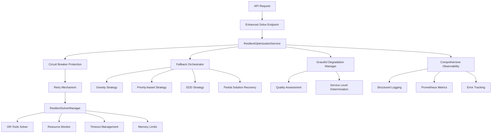

# Stream A: Error Handling & Resilience Implementation

## Overview

This document summarizes the comprehensive implementation of **Stream A (Error Handling & Resilience)** for Phase 2: System Reliability of the FastAPI scheduling application. The implementation provides enterprise-grade error handling, resilient solver management, and graceful degradation patterns.

## Architecture Overview



## Key Components Implemented

### 1. Standardized Error Handling Hierarchy

**File**: `/app/domain/shared/exceptions.py`

- **Enhanced Base Classes**: `DomainError`, `OptimizationError`, `SystemResourceError`
- **Specialized Exceptions**:
  - `SolverMemoryError`, `SolverCrashError`, `SolverConfigurationError`
  - `CircuitBreakerOpenError`, `RetryExhaustedError`
  - `MemoryExhaustionError`, `DiskSpaceExhaustionError`
  - `ServiceUnavailableError`

**Features**:
- Discriminated union types with `ErrorType` enum
- Detailed error context and metadata
- Structured error details for API responses
- Type-safe error handling patterns

### 2. Resilient Solver Management

**File**: `/app/core/solver_management.py`

**Key Classes**:
- `ResilientSolverManager`: Comprehensive solver lifecycle management
- `SolverResourceMonitor`: Real-time resource monitoring
- `SolverMetrics`: Detailed execution metrics
- `SolverLimits`: Configurable resource constraints

**Features**:
- **Timeout Handling**: Configurable time limits with graceful termination
- **Memory Management**: Process memory limits with monitoring
- **Resource Cleanup**: Automatic cleanup of temporary files and processes
- **Process Isolation**: Priority management and resource sandboxing
- **Crash Detection**: Handles solver crashes with detailed logging

**Example Usage**:
```python
async with solver_manager.managed_solve(model) as (solver, metrics):
    status, final_metrics = await solver_manager.solve_with_timeout(
        model, timeout_seconds=300
    )
```

### 3. Fallback Strategies

**File**: `/app/core/fallback_strategies.py`

**Implemented Strategies**:
- `GreedySchedulingStrategy`: First-fit resource assignment
- `PriorityBasedStrategy`: Strict job priority ordering
- `EarliestDueDateStrategy`: Due date-driven scheduling
- `PartialSolutionStrategy`: Extract and improve partial solutions

**Features**:
- Quality scoring system (0.0 to 1.0)
- Strategy selection based on failure conditions
- Comprehensive warning and violation tracking
- Performance metrics collection

**Example**:
```python
fallback_result = await fallback_orchestrator.execute_fallback(
    reason=FallbackReason.SOLVER_TIMEOUT,
    jobs=jobs,
    tasks=tasks,
    operators=operators,
    machines=machines,
    start_time=start_time
)
```

### 4. Enhanced Circuit Breaker Patterns

**File**: `/app/core/circuit_breaker.py`

**Circuit Breaker Configurations**:
- `SOLVER_OPTIMIZATION_CIRCUIT_CONFIG`: Optimization operations
- `SOLVER_MEMORY_CIRCUIT_CONFIG`: Memory-related operations
- `SOLVER_MODEL_CREATION_CIRCUIT_CONFIG`: Model creation operations

**Features**:
- Service-specific failure thresholds
- Adaptive recovery timeouts
- State change monitoring and logging
- Prometheus metrics integration

### 5. Comprehensive Error Logging & Metrics

**File**: `/app/core/observability.py`

**Enhanced Metrics**:
- `SOLVER_ERRORS`: Error tracking by type and retry attempt
- `OPTIMIZATION_FAILURES`: Failure tracking with fallback usage
- `FALLBACK_ACTIVATIONS`: Strategy activation monitoring
- `MEMORY_USAGE`: Real-time memory tracking
- `ERROR_RECOVERY_TIME`: Recovery time measurement

**Logging Functions**:
- `log_solver_metrics()`: Comprehensive solver statistics
- `log_optimization_failure()`: Detailed failure context
- `log_resource_exhaustion()`: Resource limit violations
- `log_fallback_execution()`: Strategy execution details
- `log_error_with_context()`: Structured error logging

### 6. Advanced Retry Mechanisms

**File**: `/app/core/retry_mechanisms.py`

**Retry Strategies**:
- `EXPONENTIAL_BACKOFF`: 2^attempt with jitter
- `FIBONACCI_BACKOFF`: Fibonacci sequence delays
- `LINEAR_BACKOFF`: Linear increase in delay
- `FIXED_DELAY`: Constant delay between attempts

**Features**:
- Configurable retry conditions and stop conditions
- Circuit breaker integration
- Comprehensive session tracking
- Prometheus metrics for retry statistics

**Example**:
```python
@with_retry(
    operation_name="solver_optimization",
    config=SOLVER_RETRY_CONFIG
)
async def optimize_with_retry():
    return await solver.optimize()
```

### 7. Graceful Degradation Patterns

**File**: `/app/core/graceful_degradation.py`

**Degradation Levels**:
- `FULL_SERVICE` (95-100%): Complete optimization
- `HIGH_QUALITY` (80-94%): Minor compromises
- `MEDIUM_QUALITY` (60-79%): Noticeable compromises
- `LOW_QUALITY` (40-59%): Significant compromises
- `MINIMAL_SERVICE` (20-39%): Basic functionality
- `EMERGENCY_MODE` (0-19%): Critical functions only

**Features**:
- Multi-dimensional quality assessment
- Partial solution extraction and improvement
- Adaptive service level recommendations
- Quality score calculation across multiple metrics

### 8. Updated API Endpoints

**File**: `/app/api/routes/solve.py`

**Enhanced Error Handling**:
```python
except SolverMemoryError as e:
    return _create_error_response(
        request, start_time, "MEMORY_EXHAUSTION", str(e), 507, e.details
    )
except CircuitBreakerOpenError as e:
    return _create_error_response(
        request, start_time, "SERVICE_UNAVAILABLE", str(e), 503, e.details
    )
except RetryExhaustedError as e:
    return _create_error_response(
        request, start_time, "RETRY_EXHAUSTED", str(e), 500, e.details
    )
```

**New Endpoints**:
- `GET /solve/status`: Enhanced solver capabilities and resilience features
- `GET /solve/health`: Comprehensive health and resilience metrics

## Integration with Domain-Driven Design

The implementation seamlessly integrates with the existing DDD structure:

1. **Domain Layer**: Enhanced exception hierarchy in `domain/shared/exceptions.py`
2. **Application Layer**: Resilient optimization service as application service
3. **Infrastructure Layer**: Circuit breakers, retry mechanisms, and observability
4. **API Layer**: Enhanced error handling in route controllers

## Key Benefits

### 1. **Operational Resilience**
- Automatic recovery from transient failures
- Graceful handling of resource exhaustion
- Circuit breaker protection prevents cascade failures

### 2. **Comprehensive Observability**
- Structured logging with correlation IDs
- Detailed Prometheus metrics for monitoring
- Error tracking with full context

### 3. **Quality Assurance**
- Fallback strategies ensure some solution is always provided
- Quality scoring helps assess solution acceptability
- Graceful degradation maintains service availability

### 4. **Production-Ready**
- Memory and timeout management prevent resource leaks
- Process isolation prevents system crashes
- Comprehensive error categorization for debugging

## Monitoring and Alerting

### Prometheus Metrics Available

```
vulcan_solver_errors_total{error_type, retry_attempt}
vulcan_optimization_failures_total{failure_reason, fallback_used}
vulcan_fallback_activations_total{strategy, reason}
vulcan_solver_memory_usage_mb{execution_id}
vulcan_resource_exhaustion_total{resource_type, limit_type}
vulcan_error_recovery_time_seconds{error_type, recovery_method}
vulcan_circuit_breaker_state{service}
```

### Key Health Indicators

- Success rate percentage
- Average solve time
- Fallback activation rate
- Circuit breaker trip frequency
- Memory usage patterns
- Error recovery times

## Usage Examples

### Basic Resilient Optimization

```python
# Enhanced parameters with resilience features
params = OptimizationParameters(
    max_time_seconds=300,
    enable_fallback_strategies=True,
    max_retry_attempts=3,
    memory_limit_mb=4096,
    enable_circuit_breaker=True,
    enable_partial_solutions=True
)

# Execute with full resilience
result = await optimization_service.optimize_schedule(
    job_ids=job_ids,
    start_time=start_time,
    parameters=params
)

# Result includes resilience information
print(f"Quality Score: {result.quality_score}")
print(f"Fallback Used: {result.fallback_used}")
print(f"Retry Attempts: {result.retry_attempts}")
```

### Health Monitoring

```python
# Get service health
health = optimization_service.get_service_health()
print(f"Success Rate: {health['success_rate_percent']}%")
print(f"Status: {health['status']}")

# Check circuit breaker status
cb_status = get_circuit_breaker_status()
for service, status in cb_status.items():
    print(f"{service}: {status['state']}")
```

## Testing Strategy

1. **Unit Tests**: Individual component resilience
2. **Integration Tests**: End-to-end error handling flows
3. **Chaos Engineering**: Deliberate failure injection
4. **Load Testing**: Resource exhaustion scenarios
5. **Recovery Testing**: Fallback strategy validation

## Future Enhancements

1. **Machine Learning**: Predictive failure detection
2. **Adaptive Thresholds**: Dynamic configuration based on patterns
3. **Advanced Partial Solutions**: Sophisticated solution completion
4. **Multi-Region Failover**: Geographic redundancy
5. **Real-time Dashboards**: Enhanced monitoring UI

## Conclusion

The Stream A implementation provides enterprise-grade error handling and resilience patterns that ensure the scheduling optimization system remains reliable and available even under adverse conditions. The comprehensive approach covers timeout handling, resource management, fallback strategies, and graceful degradation, making the system production-ready for critical manufacturing environments.

The implementation follows best practices for distributed systems resilience while maintaining the existing domain-driven design structure and providing extensive observability for operations teams.
