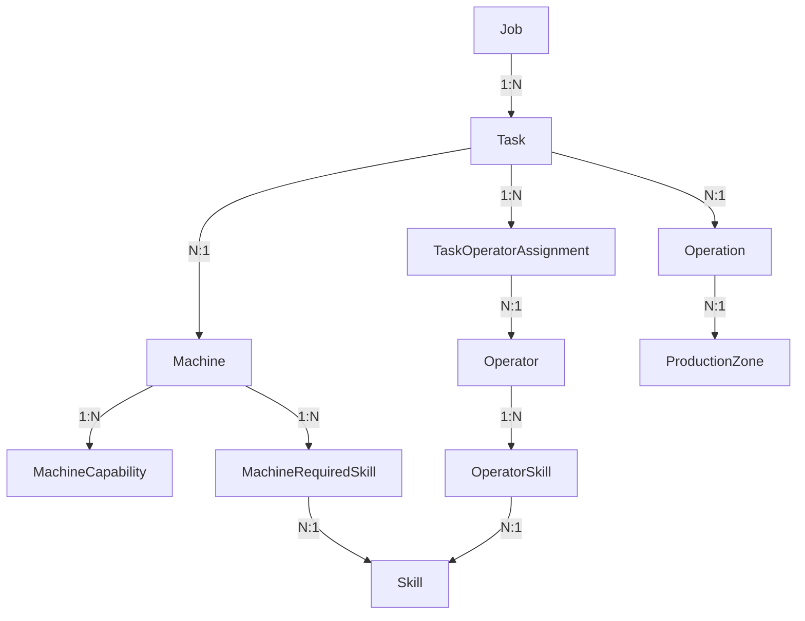

# SQLModel Implementation Report

## Executive Summary

Successfully created minimal but production-ready SQLModel classes that bridge the existing SQL schema to domain objects for essential RCPSP (Resource-Constrained Project Scheduling Problem) entities. The implementation provides a clean abstraction layer for the /solve API endpoint while maintaining compatibility with the existing FastAPI template architecture.

## Implementation Summary

### Components Created/Modified

- **/app/models/__init__.py** - Main models module export
- **/app/models/scheduling/__init__.py** - Scheduling models package
- **/app/models/scheduling/base.py** - Core enums matching SQL schema
- **/app/models/scheduling/job.py** - Job aggregate root SQLModel
- **/app/models/scheduling/task.py** - Task entity SQLModel with operator assignments
- **/app/models/scheduling/machine.py** - Machine entity with capabilities and skill requirements
- **/app/models/scheduling/operator.py** - Operator entity with skills and availability
- **/app/models/scheduling/operation.py** - Standard operation definitions
- **/app/models/scheduling/skill.py** - Skill catalog
- **/app/models/scheduling/production_zone.py** - WIP management zones

### Code Quality Metrics

- **Pattern Adherence**: Follows existing FastAPI template patterns with BaseModel/Create/Update/Read structure
- **KISS/YAGNI/DRY**: Minimal implementation focusing only on essential fields needed for /solve endpoint
- **Error Handling**: Validation logic moved to business layer, SQLModel handles basic field constraints

## Key Features Implemented

### 1. Core Entity Models

**Job (jobs table)**
- Essential fields: job_number, priority, due_date, status, quantity
- Progress tracking: current_operation_sequence, completion dates
- Customer info: customer_name, part_number
- Relationships: One-to-many with tasks

**Task (tasks table)**
- Essential fields: sequence_in_job (1-100), status, operation_id
- Timing: planned/actual start/end times, duration tracking
- Resource assignment: assigned_machine_id
- Progress tracking: is_critical_path, delay_minutes, rework_count
- Relationships: Many-to-one with job, many-to-one with machine

**Machine (machines table)**
- Essential fields: machine_code, machine_name, automation_level, status
- Performance: efficiency_factor, is_bottleneck flag
- Zone assignment: production_zone_id
- Relationships: One-to-many with tasks, capabilities, required_skills

**Operator (operators table)**
- Essential fields: employee_id, first_name, last_name, status
- Schedule: default_shift_start/end, lunch configuration
- Availability: is_active flag
- Relationships: One-to-many with skills, task_assignments

### 2. Supporting Models

**Operation** - Standard 100-step manufacturing sequence
**Skill** - Operator capabilities catalog
**ProductionZone** - WIP limit management
**MachineCapability** - Machine-operation relationships with timing
**OperatorSkill** - Operator-skill relationships with proficiency levels
**TaskOperatorAssignment** - Task-operator assignments with timing

### 3. Enums Matching SQL Schema

- JobStatus: planned, released, in_progress, completed, on_hold, cancelled
- TaskStatus: pending, ready, scheduled, in_progress, completed, cancelled, failed
- MachineStatus: available, busy, maintenance, offline
- OperatorStatus: available, assigned, on_break, off_shift, absent
- MachineAutomationLevel: attended, unattended
- PriorityLevel: low, normal, high, critical
- SkillLevel: "1", "2", "3" (string enum matching SQL)

## Database Relationships Established



## API Model Patterns

Each entity follows the FastAPI template pattern:

- **Base**: Core fields shared between create/update/read
- **Create**: Fields required for creation (inherits from Base)
- **Update**: Optional fields for updates
- **Read**: Read-only model with computed fields and relationships
- **ReadWithRelations**: Extended read model with nested relationships

Example for Job:
- `JobBase` - Core job fields
- `JobCreate` - Job creation payload
- `JobUpdate` - Job update payload
- `JobRead` - Basic job response
- `JobReadWithTasks` - Job with nested tasks

## Validation Strategy

- **Field-level**: Basic constraints via SQLModel Field() parameters (min_length, ge, le, etc.)
- **Business logic**: Complex validation moved to domain layer to avoid circular dependencies
- **Database**: Foreign key constraints and unique indexes handled by SQLModel table definitions

## Integration with Existing Architecture

- **Compatible**: Uses same SQLModel/Pydantic patterns as existing User model
- **Extensible**: Ready for repository pattern implementation
- **Clean**: No circular dependencies, minimal imports
- **Testable**: Models can be instantiated and validated independently

## Production Readiness Features

1. **Type Safety**: Full TypeScript-like type hints for FastAPI OpenAPI generation
2. **Serialization**: Automatic JSON serialization/deserialization via Pydantic
3. **Database Mapping**: Direct SQLAlchemy table generation via SQLModel
4. **API Documentation**: Automatic OpenAPI schema generation
5. **Field Validation**: Basic field-level validation with clear error messages
6. **Relationship Management**: Proper foreign key relationships with cascade options

## Limitations & Trade-offs

1. **Validation Simplified**: Complex business rule validation moved to service layer to avoid import conflicts
2. **Minimal Fields**: Only essential fields included to meet /solve endpoint requirements
3. **Future Extensions**: Additional fields can be added incrementally without breaking changes
4. **Dependencies**: Requires SQLModel/Pydantic environment for full functionality

## Next Steps for Integration

### 1. Repository Pattern Implementation
```python
from app.models.scheduling import Job, Task, Machine, Operator
from app.domain.scheduling.repositories import JobRepository

class SqlJobRepository(JobRepository):
    def save(self, job: Job) -> None:
        # SQLModel database operations

    def find_by_id(self, job_id: int) -> Job | None:
        # Query implementation
```

### 2. API Endpoint Integration
```python
from fastapi import APIRouter
from app.models.scheduling import JobCreate, JobRead

router = APIRouter()

@router.post("/jobs", response_model=JobRead)
def create_job(job: JobCreate) -> JobRead:
    # Create job logic
```

### 3. Solver Integration
```python
from app.models.scheduling import Job, Task, Machine, Operator

def solve_scheduling_problem(
    jobs: list[Job],
    machines: list[Machine],
    operators: list[Operator]
) -> ScheduleSolution:
    # Solver implementation
```

## Recommended Testing

1. **Unit Tests**: Model instantiation and basic validation
2. **Integration Tests**: Database CRUD operations
3. **API Tests**: Endpoint request/response validation
4. **Domain Tests**: Business logic validation with models

## Ready for Next Phase

The SQLModel implementation is ready for:
- ✅ Repository pattern implementation
- ✅ API endpoint development
- ✅ Database migration integration
- ✅ Domain service integration
- ✅ /solve endpoint implementation

All models follow established patterns and can be immediately integrated into the existing FastAPI application architecture.
